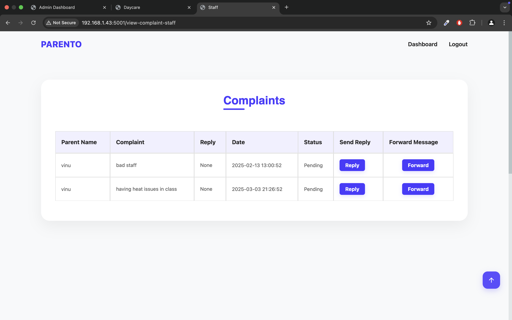

# PARENTO - Caretaker & Parent Communication App

PARENTO is a application designed to streamline communication between caretakers and parents. The app provides a user-friendly interface for real-time updates on children's activities, health tracking, photo sharing, feedback, and more. With PARENTO, parents can stay connected with their children's daycare activities, monitor progress, and interact with caretakers easily.

## Technology 

- Flutter, Dart
- Flask, Python
- HTML, CSS, JAVASCRIPT
- Mysql
- API (Razorpay)

## Screenshots Mobile

  
  
  

  
  
  

  
  
  

  
  
  

  
  
  

  
  
  

  
  
  

  

## Screenshots Web

  
  
  

  
  
  

  
  
  

  
  
  

  
  
  

  
  
  

  
  
  

  
  
  

  
  
  

  
  

